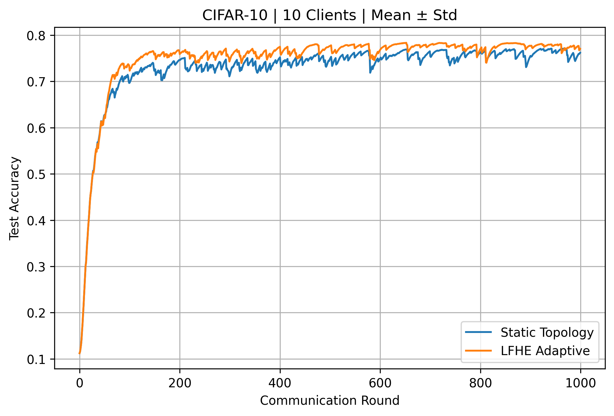
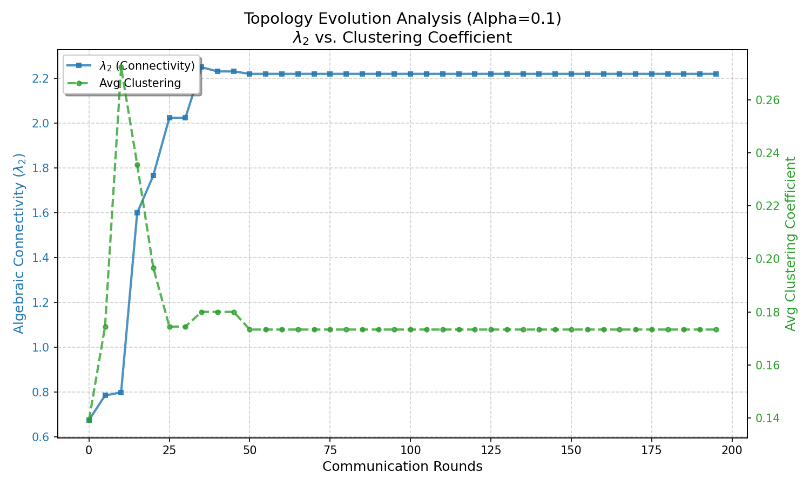
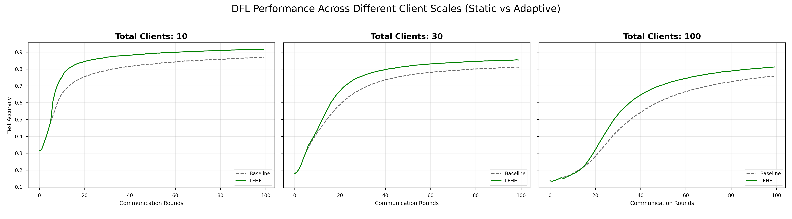

# LFHE

Local-First Heuristic Evolution (LFHE) adapts peer-to-peer learning topology using only local neighborhood information under bounded communication.



## Research Question

How can fully decentralized learners adapt communication topology using only local information while maintaining bounded communication under non-IID data?

## Method

LFHE treats the communication graph as part of the learning system. Each learner observes its ego graph, discovers friend-of-friend candidates, scores candidate updates with local structural and exploration signals, and then adds, swaps, or rejects edges under degree control.

The implementation preserves decentralized model averaging, Dirichlet non-IID client partitions, bounded-degree topology updates, and static baselines including ring, random, fully connected, FedAvg-reference, and DissDL-style comparison code.

## Main Results

Centralized and dense references are useful upper bounds, but they solve a different communication problem from bounded decentralized learning. LFHE should be compared primarily with the decentralized sparse baselines.

| Method            |         CIFAR-10 |        CIFAR-100 |  Speech Commands |     Sentiment140 |
| ----------------- | ---------------: | ---------------: | ---------------: | ---------------: |
| FedAvg            |     78.40 ± 0.80 |     51.90 ± 0.30 |     86.80 ± 0.50 |     70.60 ± 2.70 |
| Fully Connected   |     78.40 ± 0.70 |     51.80 ± 0.50 |     86.40 ± 1.40 |     70.60 ± 2.60 |
| Ring              |     52.60 ± 1.20 |     27.00 ± 0.80 |     53.00 ± 3.10 |     58.00 ± 2.70 |
| Static Random     |     67.40 ± 1.70 |     41.70 ± 1.20 |     74.20 ± 3.50 |     63.50 ± 2.30 |
| Epidemic Learning |     70.00 ± 1.60 |     44.10 ± 0.70 |     78.10 ± 3.30 |     65.50 ± 2.30 |
| DissDL            |     63.70 ± 2.10 |     40.20 ± 0.30 |     74.60 ± 3.70 |     64.20 ± 3.80 |
| **LFHE**          | **71.60 ± 2.10** | **45.20 ± 0.60** | **78.80 ± 2.30** | **65.30 ± 1.70** |

These results use five seeds. LFHE gives the strongest final decentralized result on CIFAR-10, CIFAR-100, and Speech Commands. On Sentiment140 it is competitive in final accuracy and reaches the target earlier than the decentralized alternatives.

| Dataset           | LFHE rounds-to-target |
| ----------------- | --------------------: |
| CIFAR-10 ≥70%     |                   225 |
| CIFAR-100 ≥35%    |                   125 |
| Speech ≥70%       |                    60 |
| Sentiment140 ≥65% |                   170 |

## Representative Figures

### Learning


LFHE improves convergence and decentralized final accuracy under severe non-IID heterogeneity.

### Topology



Topology diagnostics show algebraic connectivity increasing while clustering decreases during early topology evolution, consistent with broader information propagation.

### Client Scale



The client-scale artifact records how bounded topology adaptation behaves as the decentralized system size changes.

## Controlled Mechanism Evidence

Under matched friends-of-friends candidate generation and rewiring budgets, the mechanism study reports:

| Method           | Final λ2 | Final Acc. | Mean Divergence |
| ---------------- | -------: | ---------: | --------------: |
| Static           |    0.592 |     0.6675 |           0.766 |
| Similarity-only  |    0.578 |     0.6704 |           0.727 |
| Exploration-only |    1.038 |     0.7356 |           0.221 |
| Structural-only  |    2.306 |     0.7508 |           0.136 |
| LFHE             |    2.247 |     0.7482 |           0.133 |

This matched-protocol experiment provides evidence that objectives containing the structural term induce substantially stronger connectivity. It should not be read as evidence that the structural term directly optimizes algebraic connectivity.

## Reproduction

Install dependencies:

```bash
pip install -r requirements.txt
```

Primary tracked entry points:

| Experiment | Entry point |
| --- | --- |
| CIFAR-10 main / seed study | `program/train_dfl_cifar10_seeds.py` |
| CIFAR-10 baseline comparison | `program/Baseline_comparison/main.py` |
| Dirichlet-alpha sensitivity | `program/Alpha_test/main.py` |
| Topology-evolution diagnostics | `program/Topology Evolution/train_dfl_cifar10_EvolutionBehaviour.py` |
| CIFAR-100 benchmark | `program/Baseline_comparison_Cifar100/main.py` |
| Google Speech Commands benchmark | `program/Baseline_comparison_gsc/main.py` |

The Sentiment140 manuscript experiment is not currently tracked as a public source entry point in this repository.

See [docs/reproducibility.md](docs/reproducibility.md) and [docs/results_provenance.md](docs/results_provenance.md) for the reproducibility boundary, tracked source inventory, and result-artifact policy.

## Repository Structure

```text
program/     Experiment entry points and topology implementations
docs/        Reproducibility and provenance notes
figures/     Curated README figures
results/     Historical tracked result artifacts
```

## Citation and License

Author-identifying citation metadata and publication-status wording are intentionally omitted while this artifact may be used in anonymous review. No license file is currently included.
